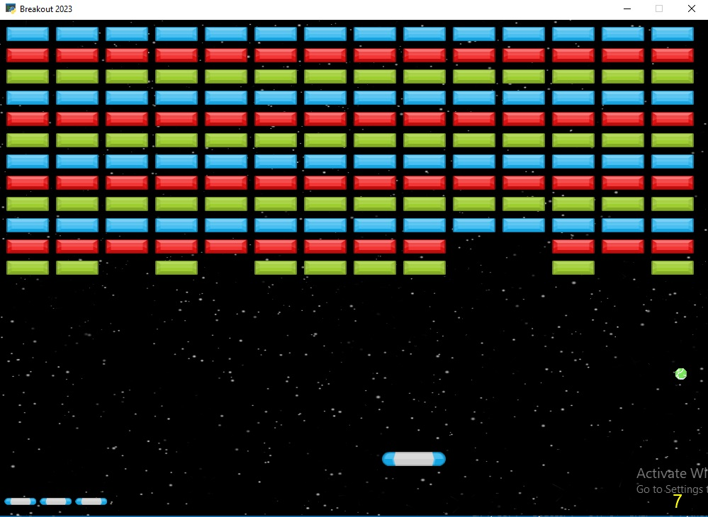

# Pong Game
    
The python version of this program uses the [Arcade](https://api.arcade.academy/en/latest/) library

---

## How to play?
The color of your paddle is yellow and computer is red.
Just move your Mouse and Don't let the ball leave your side! 
        
    When the ball goes out of the opponent's field, it counts as a point for you and vice versa.

# Breakout Game
    
The python version of this program uses the [Arcade](https://api.arcade.academy/en/latest/) library

---

## How to play?
you can move your paddle with moving your mouse or left ⬅ and right ➡ keys and Don't let the ball leave your side!

    When the ball falls out of play, one point is deducted and you lose one heart.

