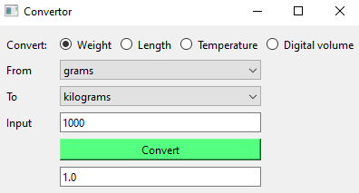

# Convertor
    
The python version of this program uses  [pyside6](http://wiki.qt.io/Qt_for_Python) library

---

---
## How to use?
First select the mode of convert:

    weight
    Lenght
    Temperature
    Digital volume

then select the units and press the **Convert** Button

