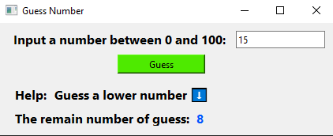

# Guess Number
    
The python version of this program uses  [pyside6](http://wiki.qt.io/Qt_for_Python) library

---

---
## How to Play?
Enter a number then press **Guess**
so you can use help to guess correctly!

Note: You have to guess the correct number within 10 times if you like to win!

