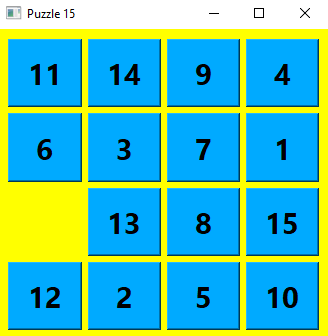

# Puzzle 15
    
The python version of this program uses the [Puzzle15](https://pypi.org/project/puzzle15-ai/) and [pyside6](http://wiki.qt.io/Qt_for_Python) library

---

---
## How to Play?
Move tiles in grid with left click of your mouse to order them from 1 to 15 

