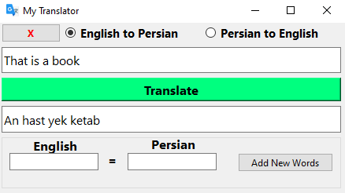

# Translator
    
The python version of this program uses  [pyside6](http://wiki.qt.io/Qt_for_Python) library

---

---
## How to use?
Select mode of translation:

    * English to Persian
    * Persian to English

Then in the first text box type your sentence and press **Translate**  Button. All of words that exist in Database will be translated.

Note: you can use **X** button to delete the sentence in the first text box

## How to add new words?
you can use the last part in the form to add new words to your dictionary.just type engilsh and its name in persian and then press the **Add new word** button to add it.

