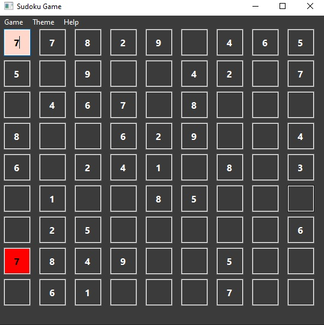

# Sudoku Game
    
The python version of this program uses the [py_sudoku](https://github.com/jeffsieu/py-sudoku) and [pyside6](http://wiki.qt.io/Qt_for_Python) library

---
## Menubar

    This game has 3 options in the menu, each of which includes a sub-option.

### Game menu

#### New game: 
By clicking this option, you can start a new game.
#### Open File: 
By clicking on this file, you can give a desired input to your Sudoku game. The input should be a text file which is a 9x9 matrix containing numbers 1 to 9. The numbers in each row must be separated by a space, and each number that the user must complete must be 0.
    
example:  text file is:

in sudoku game:

#### Solve: 
By clicking on this option, your Sudoku will be solved automatically and the entered numbers will be displayed in blue

#### Exit: 
by clicking on this option, The game will be closed.
---

### Theme menu

#### Dark Mode: 

The theme of the game will be dark.

#### Light Mode: 
The theme of the game will be light.

---
### Help menu

#### Help: 
By clicking on this option, a summary of how to play the game will be displayed.

#### About: 
Displays information about the developer of this app

---
## How to play?
The rules for sudoku are simple. A 9×9 square must be filled in with numbers from 1-9 with no repeated numbers in each line, horizontally or vertically. To challenge you more, there are 3×3 squares marked out in the grid, and each of these squares can't have any repeat numbers either.

false number is recegnized by red color!

