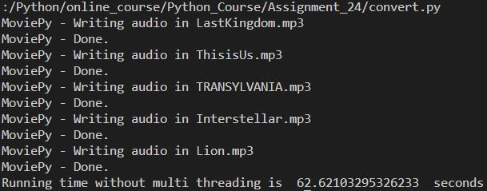
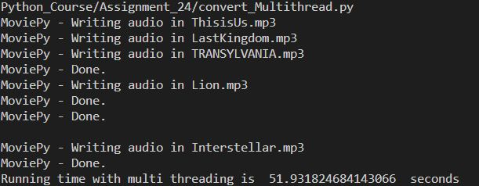

# Using Multi Thread in python
    
In this exercise, we use multi-thread in coding.

In code convert.py and convert_multithreading.py, we use [MoviePy](https://zulko.github.io/moviepy/getting_started/videoclips.html).
We convert 5 video file URLs to the audio file sequentially (convert_seq.py) and using multithreading(convert_multithreading.py).
The result of executing these two code is as follows:

In SpaceShip_MultiThread.py (one-thread code is Assignment_14), we use multi thread to create new enemies.