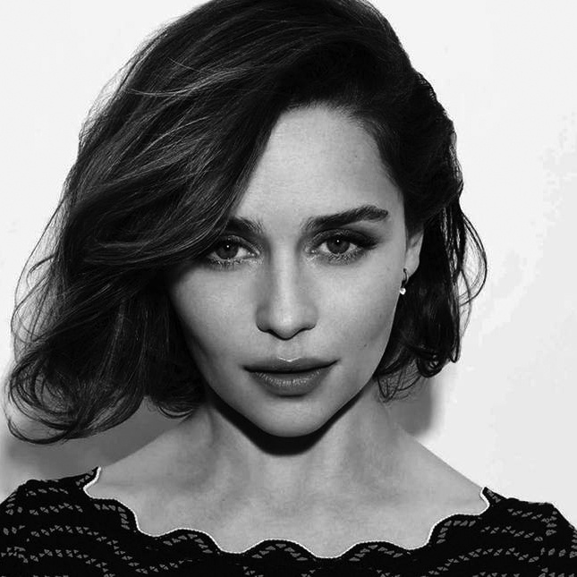

# 🌏 Digital Image Processing

in these codes, we use opencv library.

## exercise 1
In this exercise 1, We make a chess board with for loop using OpenCV.

## exercise 2
In this exercise 2, We invert dark and light colors for these pic1 and pic 2.

## exercise 3
In this exercise 3, We rotate the pic 3 in 180 degrees.

## exercise 4
In this exercise 4, We design the first character of my name

## exercise 5
In this exercise 5, We generate a gradient

## exercise 6
In this exercise 5, We add a black tape (death symbol) to an img2_converted.

