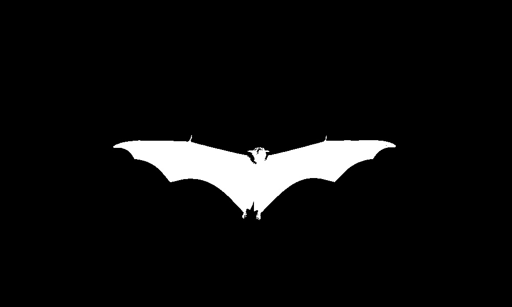
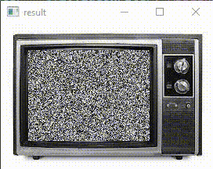

# 🌏 Digital Image Processing

in these codes, we use opencv library.

## exercise 1
In this exercise 1, We make the batman logo using OpenCV, we try 3 options.
The original image is:

The logo is:

## exercise 2
In this exercise 2, We make a TV noise.

## exercise 3
In this exercise 3, We make a landscape with snowfall.

## exercise 4
In this exercise 4, we write a color detector using webcam.

