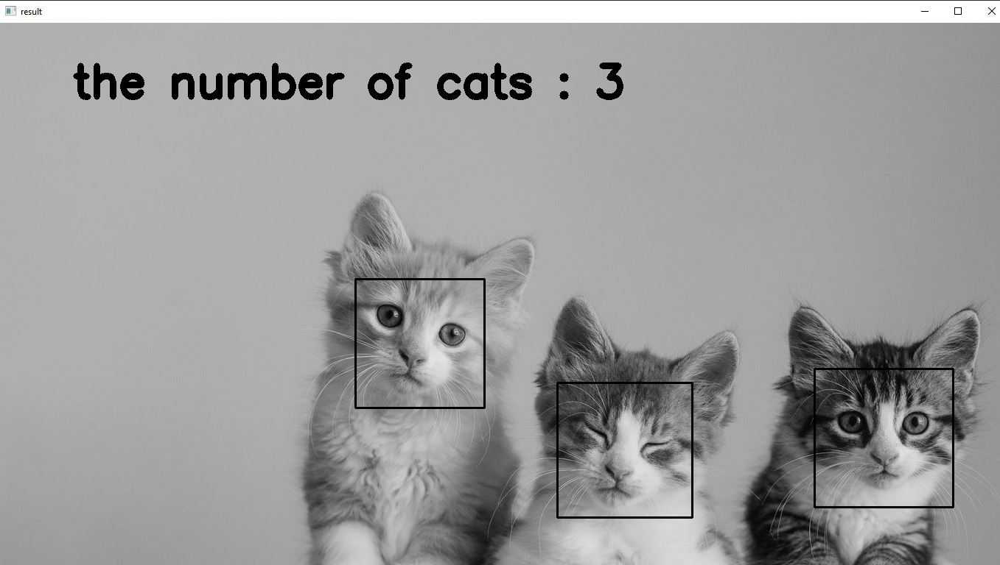
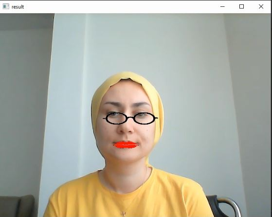

# 👩 Digital Image Processing: Face Detection

In these codes, we use [opencv](https://github.com/opencv/opencv).
we can install it with this command in terminal:
    
    pip install opencv-python

We also use [haarcascades](https://github.com/opencv/opencv/tree/4.x/data/haarcascades) for object detections like face, eye,lips,cats,etc

## exercise 1
In this exercise 1, we draw a football pitch :

## exercise 2
In this exercise 2, we read an image and count number of cats in it .

Input:

output:

## exercise 3
In this exercise 3, we wtire a program to open webcam and apply some filters on our face.

Press 1️⃣ on keyboard:
A non-square sticker on your face
    
Press 2️⃣ on keyboard:
Stickers on your eyes and lips (find xml files for detect eyes and lips here) 🥸

Press 3️⃣ on keyboard:
Chess-board face
    
Press 4️⃣ on keyboard:
Mirror filter
    

