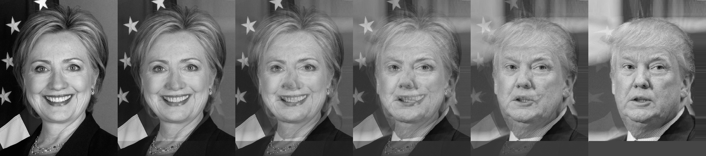
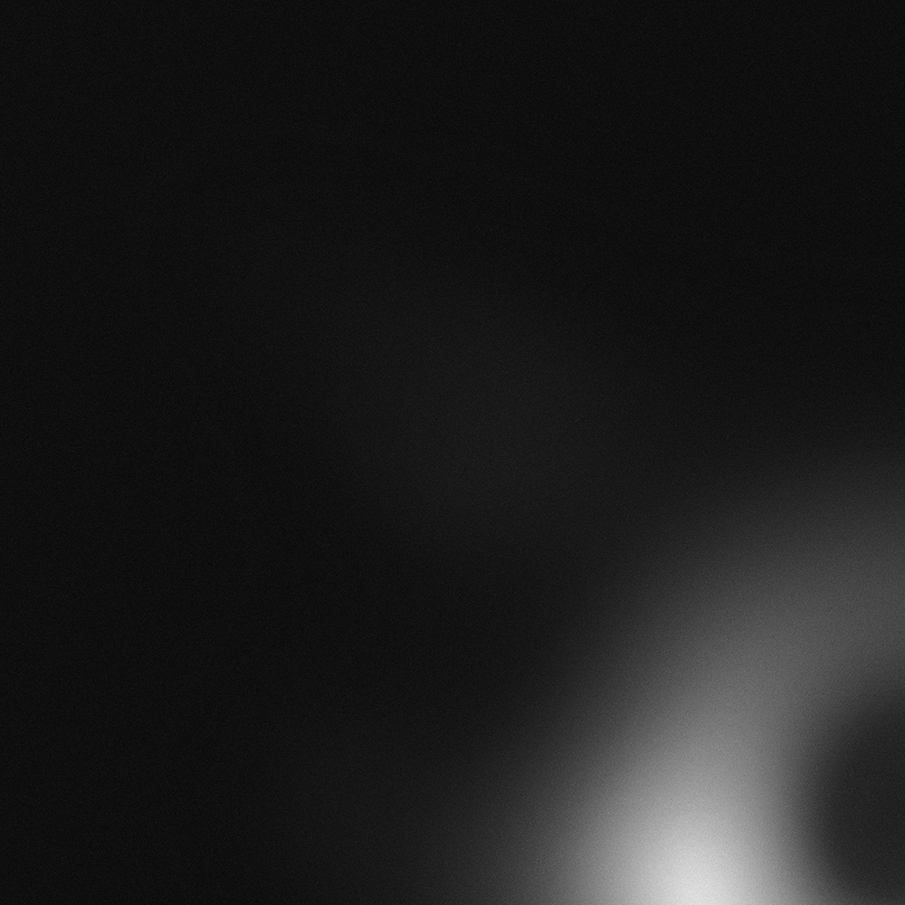
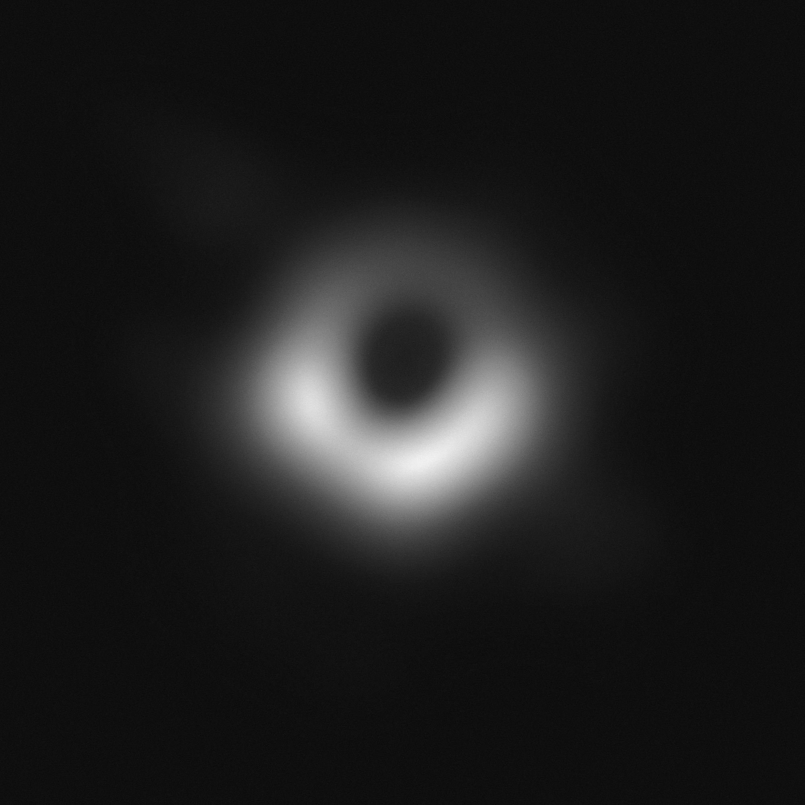
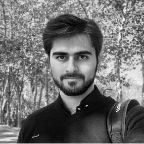
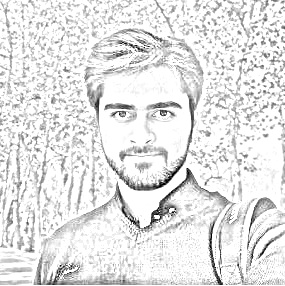
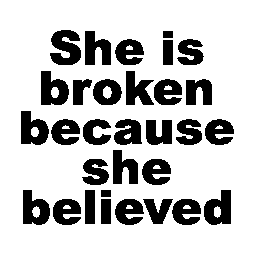
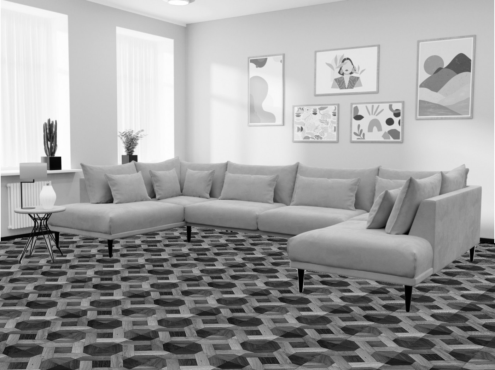

#  Digital Image Processing: Math operation In Image Proccessing

In these codes, we use [opencv](https://github.com/opencv/opencv).
we can install it with this command in terminal:
    
    pip install opencv-python

## exercise 1
In this exercise 1, we create a Morph one face into another using OpenCV  :

## exercise 2
In this exercise 2, we use image processing and numpy to reduce noise in black hole images, then concatinate them together to make complete image. .

Input:

output of noise reducing:

result of concatinating of all image after denoising:

## exercise 3
In this exercise 3, we Sketch a photo.
Input:

output:

## exercise 4

In this exercise , we use Subtraction operation to find the secret text.

Input:

output:

## exercise 5

In this exercise,we calculate average of video frames to make an image of empty road, without cars.

## exercise 6
In this exercies, we use mask to apply new floor in the room.we use multiply and add operation.
Input:

output:

